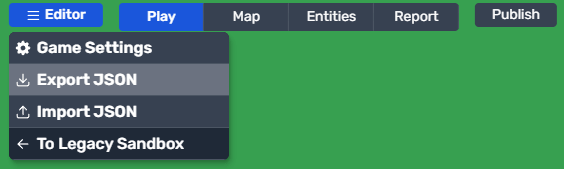

<div align="center">
  <h2><a href="https://modd.io">Moddio Game Engine 2</a></h2>
  <p>Moddio is a Multiplayer-First Game Engine. It has a built-in server-authoritative netcode, including snapshot interpolation and client-side reconciliation. It can support 50+ concurrent players or 300+ moving entities hosted on a $5/month VM. Join us on <a href="https://discord.gg/XRe8T7K">Discord</a>
</div>

<div align="center">
  
  
  
</div>

<h3><a href="http://modd.io/play/two-houses">Demo</a></h3>
<br>

## What's included in the box.

- Box2D Physics
- Server-authoritative netcode using Websocket, Snapshot interpolation, Client-side reconciliation, and LZ-string compression
- Inventory & Item system
- Built-in Attributes (e.g. HP, Energy, etc) with regeneration rates
- Built-in Item system (melee & projectile)
- Dialogues (ideal for visual novel-style games)
- Shops (for selling items)
- Unit control (top-down WASD or platformer)
- Client-side predicted projectile + unit movement (optional)
- Unit AI including A\* pathfinding
- Mobile controls
- and more!

## Running the game

Make sure you have [Node 16](https://nodejs.org) or later.
First, setup the repo

```
git clone https://github.com/moddio/moddio2.git
cd moddio2
npm install
npm run tsc
```

Then, to start the server run:

```
npm run server
```

You can now play the game at http://localhost:8080

## How do I create a new game from scratch?

Moddio games are created & edited using Moddio Game Editor available at [https://www.modd.io](https://www.modd.io).
To learn how to use the game editor, visit [https://learn.modd.io](https://learn.modd.io).

After creating your game, you can export the `game.json` file for use in your local installation. To do this, navigate to `Menu` in the Moddio Game Editor and click `Export Game`.



Next, rename the downloaded Game JSON file to `game.json` and move it into the `src` directory.

To load your game file, simply start the server by running:

```bash
npm run server
```

You will be presented with a dropdown menu, where you can use the arrow keys to select your game file. Alternatively, you can pre-select your game file by running:

```bash
npm run server --game=game.json
```

## How to contribute

Moddio is completely free and open source under the MIT license, and we are always looking for more contributors.
To learn about how to become a contributor, please visit [how to contribute page](https://docs.modd.io/how-to-contribute)

## Credits

[Isogenic Game Engine](https://www.isogenicengine.com/)

[Phaser](https://phaser.io/)

[PlanckJS](https://github.com/piqnt/planck.js)

[uWebsocket](https://github.com/uNetworking/uWebSockets)

[Box2D](https://github.com/erincatto/box2d)

[Kenney Assets](https://www.kenney.nl/)

[Hero Icons](https://github.com/tailwindlabs/heroicons)
