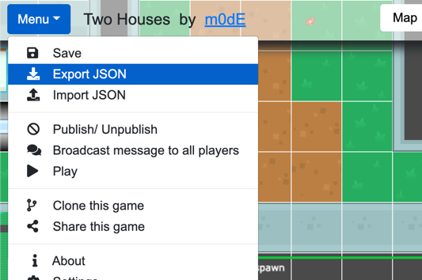

<div align="center">
  <h2><a href="https://modd.io">Moddio Game Engine 2</a></h2>
  <p>Moddio is a multiplayer-first game engine. It can support up to 64 concurrent players hosted on a $5 / month VM while running Box2D physics. Join us on <a href="https://discord.gg/XRe8T7K">Discord</a>
</div>

<div align="center">
  
  
  
</div>


<h3><a href="http://modd.io/play/two-houses">Demo</a></h3>
<br>

## What's included in the box.
- Box2D Physics
- Netcode using UWS and LZ-string compression
- Inventory & item system
- Unit attributes (HP, Energy, etc)
- Weapon system (melee & projectile)
- Dialogues
- Shops
- Unit control (top-down WASD or platformer)
- Client-side predicted projectile + unit movement (optional)
- Unit AI including A* pathfinding
- Mobile controls
- and more!

## Node Version
Node Versions below [14](https://nodejs.org) are not supported due to package incompatibility and degraded performance.

## Running a game server
Moddio will run games made using [modd.io game editor](https://www.modd.io).

To run the game server, execute the following command:
```
npm run server
```
*The engine will use game.json stored in `/src` directory.

You can download Game JSON from your modd.io's game's in-game editor. Go to `Editor` -> Click `Export JSON`.


Alternatively, you can download Game JSON from your modd.io's game's sandbox. ([example](https://modd.io/edit/two-houses)). Go to `Menu` -> Click `Export JSON`.



Next, rename the downloaded Game JSON as `game.json` and move it to the `./src` directory.

## Quick start example - Run "Two Houses" locally

Install [Node 14](https://nodejs.org) or later and then...

```
git clone https://github.com/moddio/moddio2.git
cd moddio2
npm install
npm run server
```

## Connecting to the game server
Visit http://localhost:80 to start testing game.

## Compiling game.js for faster loading
Once you  make changes, run 
```
npm run build
```
and edit /src/index.ejs file, and comment
```
<script type="text/javascript" src="/engine/loader.js"></script>
```
and uncomment
```
<script type="text/javascript" src="./game.js"></script>
```

## How to customize game client UI
Game client's user interface is rendered by [/src/index.ejs](https://github.com/moddio/moddio2/blob/master/src/index.ejs) file and the theme files in [/src/templates/](https://github.com/moddio/moddio2/tree/master/src/templates)

## How to make games on modd.io
Please visit https://www.modd.io/tutorials for more information.

## We need contributors, and we are also hiring
Performance optimization is a hard problem that takes aeons to solve. We are always looking for more developers to help us. To be a contributor, please contact m0dE in our [Discord](https://discord.gg/XRe8T7K) If you find yourself enjoying working with us, then we should seriously consider working together.

Moddio is completely free and open source under the MIT license.

## Credits ##
[Isogenic Game Engine](https://www.isogenicengine.com/)

[Phaser](https://phaser.io/)

[PlanckJS](https://github.com/piqnt/planck.js)

[uWebsocket](https://github.com/uNetworking/uWebSockets)

[Box2D](https://github.com/erincatto/box2d)

[Kenney Assets](https://www.kenney.nl/)

[Hero Icons](https://github.com/tailwindlabs/heroicons)
